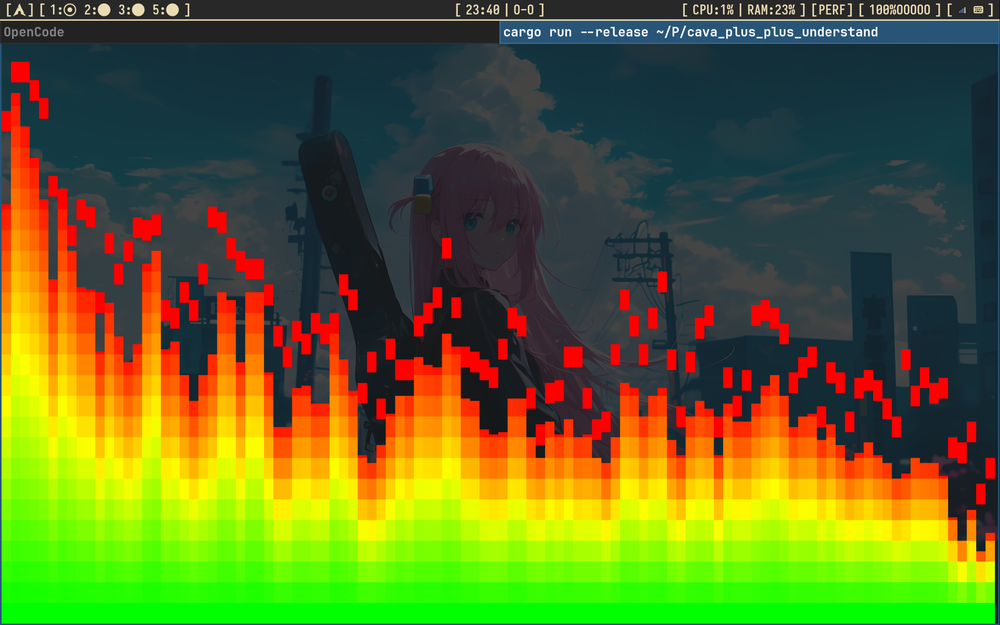

# cava_plus_plus

A small terminal audio spectrum visualizer in Rust. It is like [cava](https://github.com/karlstav/cava).

> **NOTE:** This is a toy project. It is not finished. Many features are missing. Use it for fun and learning only.

## Demo

mini_cava can show 4 display modes. The 4 videos below show each mode.

You can only change the mode by editing the `const` values in `src/main.rs` and rebuilding. There is no runtime switch yet.

### Mode 1

[Mode 1 video](./asserts/2026-09-17%2023-22-41.mp4)

### Mode 2

[Mode 2 video](./asserts/2026-09-17%2023-25-16.mp4)

### Mode 3

[Mode 3 video](./asserts/2026-09-17%2023-26-25.mp4)

### Mode 4

[Mode 4 video](./asserts/2026-09-17%2023-27-30.mp4)

### Backup image

If the videos do not play, this image shows how it looks:



## Environment

This project was only tested on:

- Arch Linux
- PipeWire (only, no PulseAudio or JACK)

It reads audio from the PipeWire `default_sink` monitor. It may not work on other systems.

## Dependencies

- Rust (nightly, edition 2024)
- System libraries: `pkgconf`, `pipewire`, `alsa-lib`, `clang`

Install on Arch Linux:

```sh
./install_deps.sh
```

## Build and run

```sh
cargo run
```

Press `q` to quit.

## How it works

- `cpal` (PipeWire host) captures the `default_sink` monitor.
- Samples go through a ring buffer, then `rustfft` does an FFT.
- FFT size is 1024, with a Hanning window. Stereo is mixed to mono.
- Magnitudes become dB: `20 * log10(norm / window_sum)`.
- `crossterm` draws the bars on the alternate screen.
- Bars use a log-frequency scale from 40 Hz to 15 kHz.
- Bars rise fast and fall slow (attack/decay smoothing).
- `autosens` scales the gain so the tallest bar reaches the top.
- Each bar has a peak cap that falls slowly.
- Bar color is a gradient: green -> yellow -> red.

## Tuning

Change these `const` values in `src/main.rs`:

| Constant             | Default                 | Meaning                            |
| -------------------- | ----------------------- | ---------------------------------- |
| `FFT_SIZE`           | 1024                    | FFT window size                    |
| `DB_FLOOR`           | -60.0                   | dB floor for bar height            |
| `GRAVITY`            | 1.2                     | power curve (>1 drops quiet bars)  |
| `ATTACK` / `DECAY`   | 1.0 / 0.08              | bar rise / fall speed              |
| `LOWER_CUTOFF_FREQ`  | 40.0                    | lowest bar frequency (Hz)          |
| `HIGHER_CUTOFF_FREQ` | 15000.0                 | highest bar frequency (Hz)         |
| `AUTOSENS_RISE`      | 0.05                    | autosens gain rise speed           |
| `SENSITIVITY_MAX`    | 50.0                    | autosens gain cap                  |
| `CAP_SIZE`           | 8                       | peak cap height (1/8 cells, 8 = 1 cell) |
| `CAP_GRAVITY`        | 1.0                     | peak cap fall step (1/8 cells)     |
| `BAR_WIDTH`          | 1                       | bar width (columns)                |
| `BAR_SPACING`        | 0                       | gap between bars (columns)         |
| `GRADIENT`           | green -> yellow -> red  | vertical color stops               |
