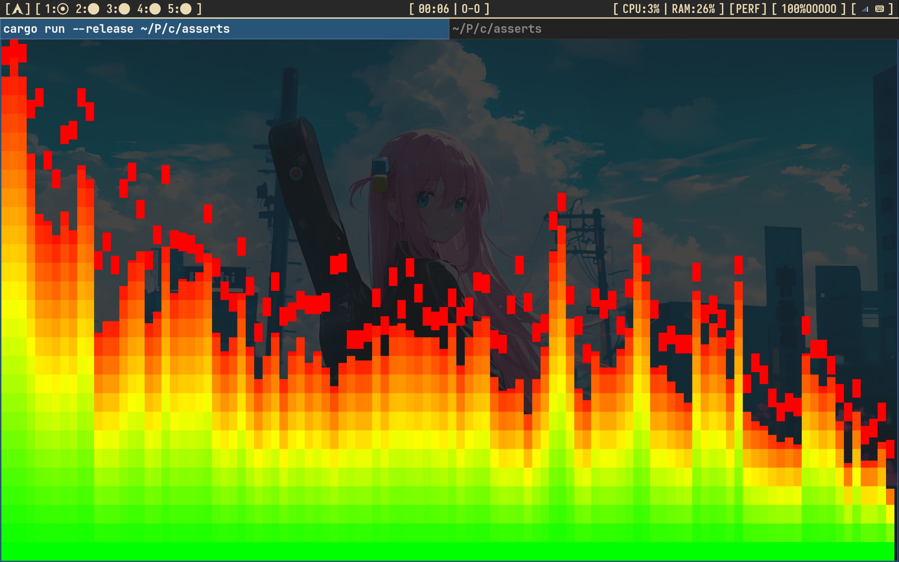
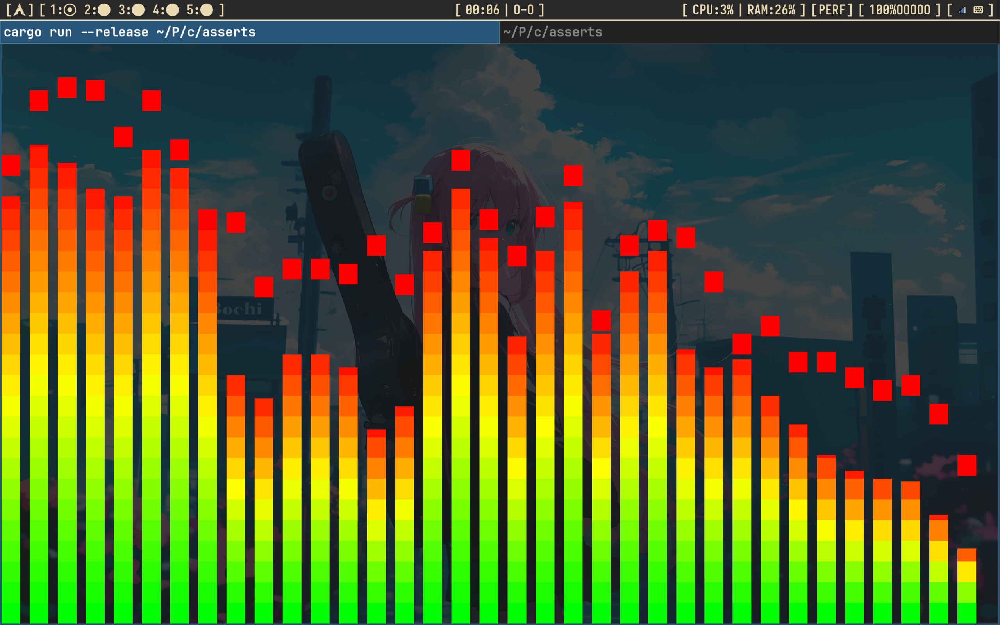
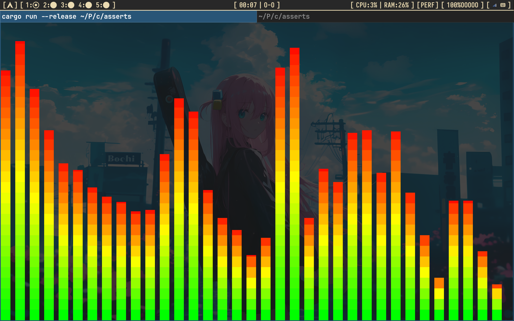
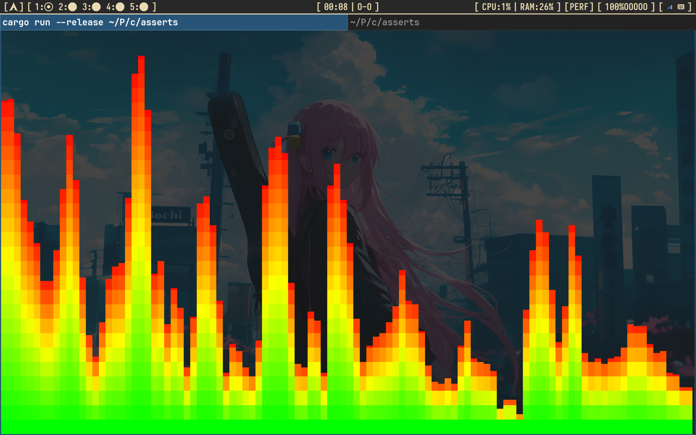

# cava_plus_plus

A small terminal audio spectrum visualizer in Rust. It is like [cava](https://github.com/karlstav/cava).

> **NOTE:** This is a toy project. It is not finished. Many features are missing. Use it for fun and learning only.

## Demo

mini_cava can show 4 display modes. The 4 videos below show each mode.

You can only change the mode by editing the `const` values in `src/main.rs` and rebuilding. There is no runtime switch yet.

### Mode 1



### Mode 2



### Mode 3



### Mode 4



## Environment

This project was only tested on:

- Arch Linux
- PipeWire (only, no PulseAudio or JACK)

It reads audio from the PipeWire `default_sink` monitor. It may not work on other systems.

## Dependencies

- Rust (nightly, edition 2024)
- System libraries: `pkgconf`, `pipewire`, `alsa-lib`, `clang`

Install on Arch Linux:

```sh
./install_deps.sh
```

## Build and run

```sh
cargo run
```

Press `q` to quit.

## How it works

- `cpal` (PipeWire host) captures the `default_sink` monitor.
- Samples go through a ring buffer, then `rustfft` does an FFT.
- FFT size is 1024, with a Hanning window. Stereo is mixed to mono.
- DC is removed by subtracting each frame's mean before windowing.
- Each bar sums the linear magnitudes (`norm / window_sum`) of its FFT bins,
  then converts to dB with `20 * log10(sum)`.
- `crossterm` draws the bars on the alternate screen.
- Bars use a log-frequency scale from 40 Hz to 13 kHz.
- A cava-style noise-reduction filter smooths each bar over time:
  a `falloff` curve for the falling edge plus an `integral` low-pass.
- `autosens` uses cava's multiplicative gain (overshoot detection) to keep the
  tallest bar near the top without amplifying the noise floor during silence.
- Optional `monstercat` / `waves` filters blend neighbouring bars.
- Each bar has a peak cap that falls slowly.
- Bar color is an HSV rainbow gradient: hue sweeps continuously from
  `GRADIENT_START_HUE` (bottom) to `GRADIENT_END_HUE` (top).
- Full cells use the half-block `▀` with the top half in the foreground colour
  and the bottom half in the background colour, giving half-cell gradient steps.

## Tuning

Change these `const` values in `src/main.rs`:

| Constant             | Default                 | Meaning                                   |
| -------------------- | ----------------------- | ----------------------------------------- |
| `FFT_SIZE`           | 1024                    | FFT window size                           |
| `DB_FLOOR`           | -60.0                   | dB floor for bar height                   |
| `GRAVITY`            | 1.2                     | power curve (>1 drops quiet bars)         |
| `NOISE_REDUCTION`    | 0.77                    | noise-reduction strength (0..1]           |
| `FRAMERATE`          | 60.0                    | nominal frame rate for smoothing/autosens |
| `AUTOSENS`           | 1.0                     | autosens gain rise speed                  |
| `MONSTERCAT`         | 0.0                     | monstercat neighbour smoothing (0 = off)  |
| `WAVES`              | 0                       | waves neighbour smoothing (0 = off)       |
| `LOWER_CUTOFF_FREQ`  | 40.0                    | lowest bar frequency (Hz)                 |
| `HIGHER_CUTOFF_FREQ` | 13000.0                 | highest bar frequency (Hz)                |
| `CAP_SIZE`           | 0                       | peak cap height (1/8 cells, 8 = 1 cell)   |
| `CAP_GRAVITY`        | 1.0                     | peak cap fall step (1/8 cells)            |
| `BAR_WIDTH`          | 2                       | bar width (columns)                       |
| `BAR_SPACING`        | 1                       | gap between bars (columns)                |
| `GRADIENT_START_HUE` | 0.0                     | gradient hue at the bottom (deg)          |
| `GRADIENT_END_HUE`   | 360.0                   | gradient hue at the top (deg)             |
| `GRADIENT_SAT`       | 1.0                     | gradient saturation (0..1)                |
| `GRADIENT_VAL`       | 1.0                     | gradient value/brightness (0..1)          |
